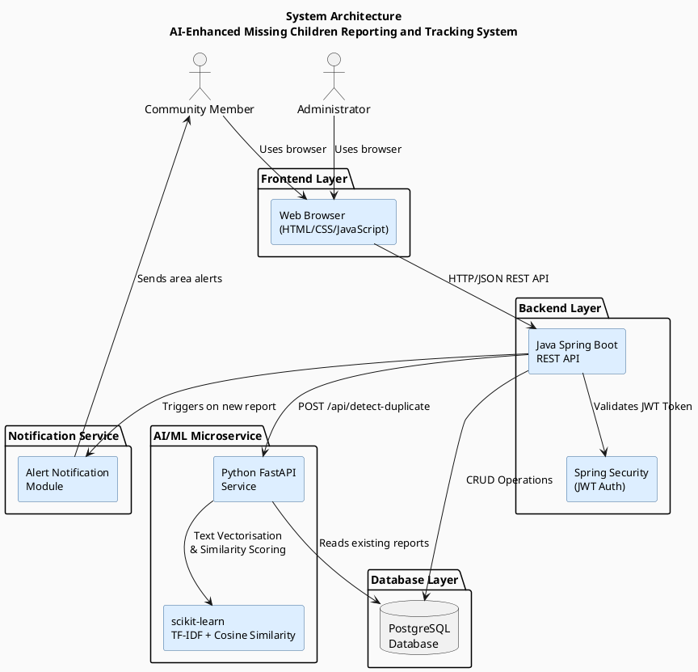
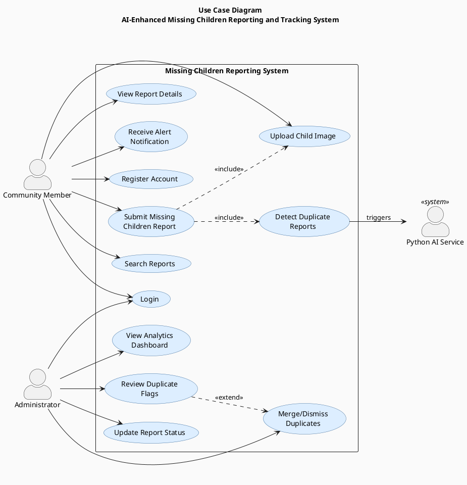
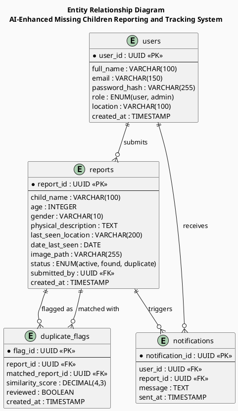
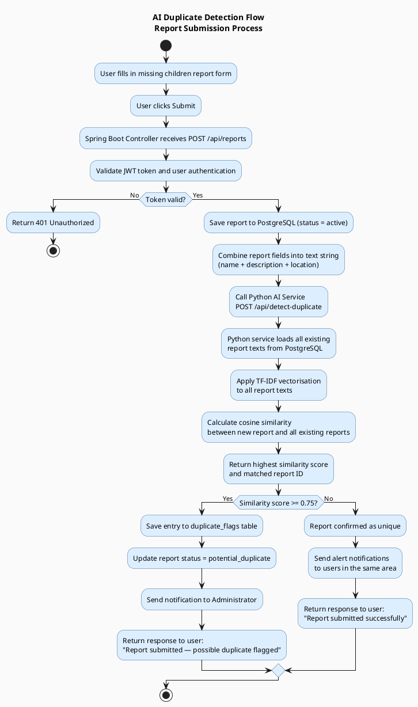
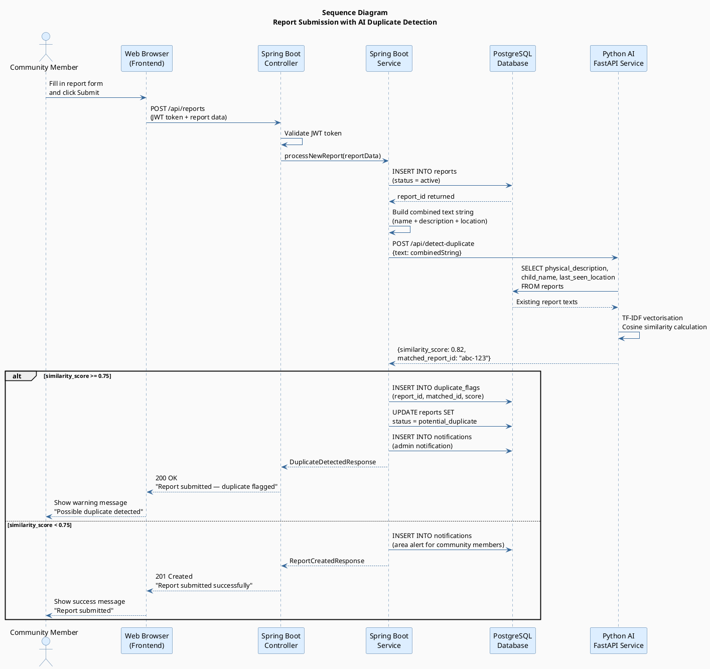

# PlantUML Diagrams
## AI-Enhanced Community-Based Missing Children Reporting and Tracking System

---

## How to Render These Diagrams

1. Go to https://www.plantuml.com/plantuml/uml/
2. Copy each diagram code block below
3. Paste it into the editor
4. Click "Submit" — the diagram renders instantly
5. Right-click the diagram image → Save as PNG
6. Insert the PNG into your Word document

---

## Diagram 1 — System Architecture Diagram

---

## Diagram 2 — Use Case Diagram (UML)

---

## Diagram 3 — Entity Relationship Diagram (ERD)

---

## Diagram 4 — AI Duplicate Detection Flow Diagram

---

## Diagram 5 — Sequence Diagram (UML)

---

## Summary of Diagrams

| # | Diagram | Section in Assignment | Tool |
|---|---|---|---|
| 1 | System Architecture | Technology Stack | PlantUML |
| 2 | Use Case Diagram | User Stories / Functional Requirements | PlantUML |
| 3 | ERD | Database Design | PlantUML |
| 4 | AI Flow Diagram | Emerging Tech Code Integration | PlantUML |
| 5 | Sequence Diagram | Emerging Tech Code Integration | PlantUML |

Render each at https://www.plantuml.com/plantuml/uml/ and save as PNG.
